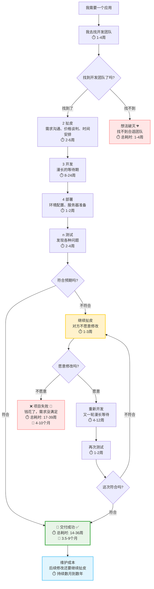

生成api文档：[generate-swagger.sh](generate-swagger.sh) 生成后文件在
[docs](core/app-server/docs) 下面

这是一个什么项目？

这是一个ai-agent-os的全选操作系统，是这个时代的ai原生操作系统

简单说明这个项目，每个用户（租户）都可以创建自己的应用（工作空间），然后这个应用对应的是一个后端的go服务，这个go的服务被运行在容器中
以前的应用开发范式：
我需要一个应用
1 我去找开发团队



## 时间成本分析 ⏱️

| 情况 | 总耗时  | 月数       | 成功率 |
| ------ | --------- | ------------ | -------- |
| **找不到团队**     | 1-4周   | 0.25-1个月 | 0%     |
| **最佳情况**     | 14-36周 | 3.5-9个月  | 20%    |
| **项目失败**     | 17-39周 | 4-10个月   | 30%    |
| **需要修改**     | 20-53周 | 5-13个月   | 50%    |

### 详细时间分解：

**最佳情况（一切顺利）：**

- 找团队：1-4周
- 扯皮：2-6周
- 开发：8-24周
- 部署：1-2周
- 测试：2-4周
- **总计：14-36周（3.5-9个月）**

**最坏情况（项目失败）：**

- 找团队：1-4周
- 扯皮：2-6周
- 开发：8-24周
- 部署：1-2周
- 测试：2-4周
- 继续扯皮：1-3周
- **总计：17-39周（4-10个月）**

**现实情况（需要修改）：**

- 第一轮：14-36周
- 继续扯皮：1-3周
- 重新开发：4-12周
- 再次测试：1-2周
- **总计：20-53周（5-13个月）**

**维护成本：**  持续数月到数年，每次修改都要重新扯皮

## 传统开发范式的痛点总结：

- ⏰ **时间成本高**：至少3.5个月，通常6-12个月
- 💰 **资金成本高**：开发费用 + 维护费用
- 😤 **沟通成本高**：需求理解偏差，反复扯皮
- 🎯 **成功率低**：很多项目最终不符合预期
- 🔄 **维护困难**：后续修改需要重新找团队、重新扯皮

软件开发的新范式

基于大模型的人工智能应用生成系统

最终的形态是：“所述即所得，描述即生成”

对于新范式的思考
其实整个软件的所有操作，我觉得可以简单理解成对http的调用一样，一个请求对应一个响应
这个模式基本上能解决99%的问题了，所以我们的关注点只需要关注请求和响应参数即可，传统的软件需要针对请求和响应参数进行编写前端的代码，
来渲染请求参数的输入框，和渲染响应参数的展示组件，这时候在我看来大部分都是无意义的重复劳动，还非常浪费时间精力，对不对？
但是没有界面又不行，没有界面只能去postman调用接口，这明显普通人完不转，看不懂，这时候我就想到了一个折中的点，假如把postman的这种调用“升级一下”会咋样？
是这样的，我们用一个数据定义语言，类似DSL这种，让每个参数有他自己的组件类型和各种option，默认值等等，这样我们是不是可以围绕一个api来讲故事了？想通了这一点就豁然开朗了
说干就干

先介绍一下我们的新平台是怎么做这个的，
[web](web) 这是我们的前端渲染引擎，可以对每个应用的每个api进行渲染，可以把api渲染成一个可操作的页面，让用户直接点击
[sdk](sdk) 这个是我们平台封装的标准sdk（go），基于这个sdk构建的应用可以直接被我们的app-runtime 进行管理和调用等等
[llm-coder](core/llm-coder) 这个是我们的大模型代码生成的服务，可以基于sdk生成生产可用的标准代码
[app-server](core/app-server) 用户在这里创建应用，同时在这里添加各种api（一个api就是一个功能，例如图片转换，获取工单列表，打赏金币，提交工单....）
[app-runtime](core/app-runtime) 这里是运行时对应用的管理和调用的引擎，每个应用都运行在容器中

我介绍一下流程
假如我是tencent公司的老板，我刚用这套系统，他们的需求是想要给hr部门搞个招聘管理系统，方便hr部门招人，这时候我们的操作流程是这样的
先注册用户
创建tencent_oa的app（这个tencent_oa的app可以表示这个公司，一个app里可以包含无数个功能）
然后我们创建一个标识：hr的目录，中文："HR管理中心"的服务目录，这里相当于一个文件夹一样，然后点击这个服务目录，右侧有对话框，输入你有啥需求，你说："我需要一个招聘管理系统"
然后我们直接后端基于用户的需求和我们的sdk来生成go的代码（一个go的文件就可以直接把整个招聘管理系统给构建出来），然后我们直接生成了这个招聘管理系统的页面

技术层面的解析是这样的
创建应用，后端在namespace的这个用户（租户）下创建tencent_oa这个go的项目
然后创建服务目录其实就是在刚刚的项目的api目录下创建一个hr的package，这里用来存放招聘管理系统的相关代码（hr_recruitment.go），
正常来讲一个go文件足够构建一个招聘管理系统的核心了，然后这个文件夹下面还可以有其他的一些功能
每个文件都是一个单独的系统，文件与文件直接互不相通，完全独立存在，一个文件可以包含多个接口，此时我们hr的目录下面还可以有其他功能，
例如你在对话框说："我需要一个绩效管理系统"
这时候会在hr的目录下面生成(hr_performance.go)
每次生成完毕我们都会重新编译整个go的项目，然后runtime会立刻给app发送消息，app会解析出变更的api信息，我们会立刻把数据同步到server，
这时候我们可以调用函数详情接口，获取函数的详细信息
因为每个api（function）信息都包含了详细的请求参数，响应参数，每个参数都对应的有渲染的组件类型，所以我们的前端可以根据api（function）的信息直接渲染成对应的页面，点击提交按钮会直接调用接口发起请求，拿到响应后我们可以根据
响应参数的详细信息里根据组件类型来渲染组件，这时候我们就可以在页面的目录下看到对应的功能了，这就是一个完整的功能

所以前端的难点就在于组件的渲染，这一块，因为数据结构相对复杂，所以我们需要设计一个比较强大的组件渲染引擎才可以支撑这个项目，这个渲染引擎要高度组件化
给你看一下我后端的代码大概是什么样子的

```go
type Ticket struct {
	// 【框架说明】系统字段 - ID为主键，只读权限
	ID int `json:"id" gorm:"primaryKey;autoIncrement;column:id" runner:"name:工单ID" permission:"read"`

	// 【框架说明】系统字段 - 创建时间，自动填充毫秒级时间戳，只读权限
	CreatedAt int64 `json:"created_at" gorm:"autoCreateTime:milli;column:created_at" runner:"name:创建时间" widget:"type:datetime;kind:datetime" permission:"read"`

	// 【框架说明】系统字段 - 更新时间，自动填充毫秒级时间戳，只读权限
	UpdatedAt int64 `json:"updated_at" gorm:"autoUpdateTime:milli;column:updated_at" runner:"name:更新时间" widget:"type:datetime;kind:datetime" permission:"read"`

	// 【框架说明】系统字段 - 软删除标记，不在前端显示
	DeletedAt gorm.DeletedAt `json:"deleted_at" gorm:"index;column:deleted_at" runner:"-"`

	// 【框架说明】业务字段 - 工单标题，使用input组件，支持模糊搜索，必填验证
	Title string `json:"title" gorm:"column:title" runner:"name:工单标题" widget:"type:input" search:"like" validate:"required,min=2,max=200" msg:"工单标题必填，长度2-200字符"`

	// 【框架说明】业务字段 - 问题描述，使用多行文本组件，必填验证
	Description string `json:"description" gorm:"column:description" runner:"name:问题描述" widget:"type:input;mode:text_area" validate:"required,min=10" msg:"问题描述必填，至少10字符"`

	// 【框架说明】业务字段 - 优先级，使用下拉选择组件，设置默认值为"中"
	Priority string `json:"priority" gorm:"column:priority" runner:"name:优先级" widget:"type:select;options:低,中,高" data:"default_value:中" validate:"required,oneof=低,中,高" msg:"请选择优先级"`

	// 【框架说明】业务字段 - 工单状态，使用下拉选择组件，设置默认值为"待处理"
	Status string `json:"status" gorm:"column:status" runner:"name:工单状态" widget:"type:select;options:待处理,处理中,已完成,已关闭" data:"default_value:待处理" validate:"required,oneof=待处理,处理中,已完成,已关闭" msg:"请选择工单状态"`

	// 【框架说明】业务字段 - 联系电话，使用input组件，支持模糊搜索，必填验证
	Phone string `json:"phone" gorm:"column:phone" runner:"name:联系电话" widget:"type:input" search:"like" validate:"required,min=11,max=20" msg:"联系电话必填，长度11-20字符"`

	// 【框架说明】业务字段 - 备注，使用多行文本组件，可选填写
	Remark string `json:"remark" gorm:"column:remark" runner:"name:备注" widget:"type:input;mode:text_area" search:"like"`

	// 【框架说明】业务字段 - 创建用户，使用用户组件，记录创建工单的用户
	CreateBy string `json:"create_by" gorm:"column:create_by" runner:"name:创建用户" widget:"type:user" permission:"read"`

	// 【框架说明】业务字段 - 附件，支持多文件上传，存储为JSON格式
	// 【组件说明】file_upload组件支持多种文件类型，设置最大文件大小为10MB
	Attachment *files.Files `json:"attachment" gorm:"type:json;column:attachment" runner:"name:附件" widget:"type:file_upload;multiple:true;max_size:10MB;accept:.pdf,.doc,.docx,.xls,.xlsx,.ppt,.pptx,.txt,.jpg,.png,.gif,.zip,.rar"`
}

// 【框架说明】TableName方法指定数据库表名
func (Ticket) TableName() string { return "ticket" }


```

我们可以直接解析成，json来描述这个接口，

```json
{
    "fields": [
        {
            "code": "title",
            "data": {
                "type": "string",
                "format": "",
                "source": "",
                "example": "",
                "default_value": ""
            },
            "desc": "",
            "name": "工单标题",
            "search": null,
            "widget": {
                "type": "input",
                "config": {

                }
            },
            "callbacks": null,
            "permission": null,
            "validation": "required,min=2,max=200"
        },
        {
            "code": "description",
            "data": {
                "type": "string",
                "format": "",
                "source": "",
                "example": "",
                "default_value": ""
            },
            "desc": "",
            "name": "问题描述",
            "search": null,
            "widget": {
                "type": "input",
                "config": {
                    "mode": "text_area"
                }
            },
            "callbacks": null,
            "permission": null,
            "validation": "required,min=10"
        },
        {
            "code": "priority",
            "data": {
                "type": "string",
                "format": "",
                "source": "",
                "example": "",
                "default_value": "中"
            },
            "desc": "",
            "name": "优先级",
            "search": null,
            "widget": {
                "type": "select",
                "config": {
                    "options": [
                        "低",
                        "中",
                        "高"
                    ]
                }
            },
            "callbacks": null,
            "permission": null,
            "validation": "required,oneof=低,中,高"
        },
        {
            "code": "phone",
            "data": {
                "type": "string",
                "format": "",
                "source": "",
                "example": "",
                "default_value": ""
            },
            "desc": "",
            "name": "联系电话",
            "search": null,
            "widget": {
                "type": "input",
                "config": {

                }
            },
            "callbacks": null,
            "permission": null,
            "validation": "required,min=11,max=20"
        },
        {
            "code": "remark",
            "data": {
                "type": "string",
                "format": "",
                "source": "",
                "example": "",
                "default_value": ""
            },
            "desc": "",
            "name": "备注",
            "search": null,
            "widget": {
                "type": "input",
                "config": {
                    "mode": "text_area"
                }
            },
            "callbacks": null,
            "permission": null,
            "validation": ""
        },
        {
            "code": "attachment",
            "data": {
                "type": "files",
                "format": "",
                "source": "",
                "example": "",
                "default_value": ""
            },
            "desc": "",
            "name": "附件",
            "search": null,
            "widget": {
                "type": "file_upload",
                "config": {
                    "accept": ".pdf,.doc,.docx,.xls,.xlsx,.ppt,.pptx,.txt,.jpg,.png,.gif,.zip,.rar",
                    "max_size": "10MB",
                    "multiple": true
                }
            },
            "callbacks": null,
            "permission": null,
            "validation": ""
        }
    ],
    "render_type": "form"
}
```

这下一下子就解决了前端需要手写的问题了，每次假如我们功能需要变动，我们在对话框说，我们需要新增一个xxx字段，然后可以做xxx，然后大模型直接改model，然后改逻辑，改完自动build并运行，然后自动更新function，我们刷新即可看到新的页面，运行便可用新的功能，
一套组合拳下来非常丝滑，其实我已经做过这个系统了，得出的结论是非常可行，我们目前的这一套系统是我重构的v2版本的，第一版写的不好，给自己挖了很多坑，填不上了，最终决定重写
但是并不是没有收获，实际上v1版本的项目让我收获了非常多的经验，让我重信思考了重点该在什么地方，该怎么做这个系统，v1版本我通过描述：“我需要一个工单管理系统”，1分钟后直接生成完毕，然后直接生产可用，简直逆天
这玩意比手动开发快了上千倍都不支，最重要的是跨越了技术的鸿沟，让那些不懂技术的业务领域专家（律师，医生，建筑设计师，老师，金融专家.....）等等一系列不懂技术但是有着业务想法的人可用通过自己的想法来构建自己的任何应用
最炸天的还是fork功能，由于我们基本盘做的好，我们是基于文件的项目，也就是说我们的项目代码可以随意的基于文件来分发，一个完整的项目就是一个完整的go代码文件，假如百度的oa系统需要招聘系统，这时候他看了觉得tencent的招聘系统非常好用，他们又懒得描述，直接点击tencent的招聘系统点击fork，直接fork到自己应用的服务目录下面，
底层逻辑就是把tencent的招聘系统的文件直接copy一份复制到baidu的对应服务目录下，然后重新编译，然后更新，这时候百度的服务目录下面有了一个完整且一模一样的招聘管理系统
两个项目是物理隔离的，互不影响，数据底层都是sqlite，所以数据也是完全隔离的，baidu如果想要升级这个系统，例如我想要新增一个xx字段，对tencent毫无影响
各自为政，相互独立，这样的话，真正实现了物理级别的多租户，传统的逻辑多租户，导致一堆问题，现在物理隔离后go的后端服务非常省内存，一个服务基本上10mb以内，所以以前可能需要思考大并发的问题，但是现在每个业务方想要用某个应用时候都直接fork某个应用，这时候直接实现“分封制，分而治之”
软件此时变成了一个壳子，一个模版，就像一个镜像一样，真正的用户是运行一个新的容器，曾经的集中式变成了分封制，曾经100个租户的请求全部打到同一个服务，来处理，需要考虑各种高并发问题，现在fork后各自为政
租户在自己的应用发起的请求请求的是自己的实例，一般来讲请求量不会很大，大概率不会需要再考虑高并发的问题了，这是牛逼之处，后续这个基本盘可以导致软件行业蓬勃发展，无需任何编程经验，就可以通过自己的想法构建应用，即使自己不用可以让别人来用，例如我搞个会议室预约系统，然后我不用，但是一般企业会用啊，别人看好用直接fork过去，你还能挣钱
以后打工都不需要上班了，直接在平台卖想法，即可，这是我们的愿景，懂吗？