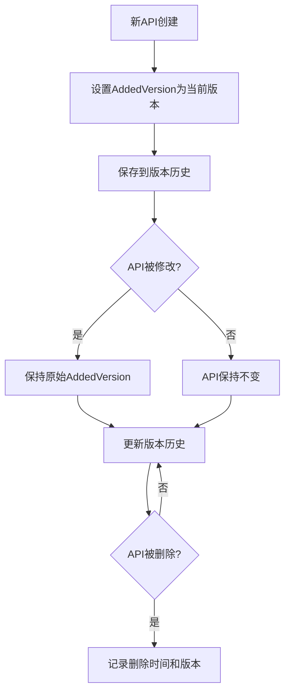

# API添加版本追踪功能

## 🎯 功能概述

在`ApiInfo`结构体中新增了`AddedVersion`字段，用于追踪每个API首次添加的版本号。这个功能可以帮助我们更好地理解API的生命周期和历史变迁。

## 🔧 实现细节

### 1. 数据结构更新

```go
type ApiInfo struct {
    Code         string          `json:"code"`
    Name         string          `json:"name"`
    Desc         string          `json:"desc"`
    Tags         []string        `json:"tags"`
    Router       string          `json:"router"`
    Method       string          `json:"method"`
    CreateTables []string        `json:"create_tables"`
    Request      []*widget.Field `json:"request"`
    Response     []*widget.Field `json:"response"`
    AddedVersion string          `json:"added_version"` // 新增：API首次添加的版本
}
```

### 2. 版本设置逻辑

#### 新增API
```go
// 在getApis()函数中，新API的AddedVersion设置为当前版本
api := &ApiInfo{
    Code:         info.getCode(),
    Name:         base.Name,
    // ... 其他字段
    AddedVersion: env.Version, // 新API首次添加时的版本
}
```

#### 修改API
```go
// 在diffApi()函数中，修改的API保持原始的AddedVersion
modifiedApi := *currentApi
modifiedApi.AddedVersion = previousApi.AddedVersion // 保持原始添加版本
```

## 📊 版本追踪场景

### 场景1：API新增
```
版本v1: 新增 "用户管理" API → AddedVersion: "v1"
版本v2: 新增 "订单管理" API → AddedVersion: "v2"
版本v3: 新增 "产品管理" API → AddedVersion: "v3"
```

### 场景2：API修改
```
版本v1: 新增 "用户管理" API → AddedVersion: "v1"
版本v2: 修改 "用户管理" API → AddedVersion: "v1" (保持不变)
版本v3: 再次修改 "用户管理" API → AddedVersion: "v1" (保持不变)
```

### 场景3：API生命周期
```
版本v1: 新增 "临时功能" API → AddedVersion: "v1"
版本v2: 修改 "临时功能" API → AddedVersion: "v1"
版本v3: 删除 "临时功能" API → AddedVersion: "v1" (在删除前仍保留)
```

## 🎯 实际应用价值

### 1. API历史追踪
```json
{
  "api": "用户管理",
  "added_version": "v1",
  "current_version": "v5",
  "age": "4个版本",
  "history": [
    {"version": "v1", "action": "add", "changes": "新增用户管理API"},
    {"version": "v2", "action": "update", "changes": "增加手机号字段"},
    {"version": "v4", "action": "update", "changes": "修改邮箱验证规则"}
  ]
}
```

### 2. 前端版本控制
```javascript
// 前端可以根据API的添加版本显示不同的UI状态
if (api.added_version === user.first_seen_version) {
  // 新功能提示
  showNewFeatureBadge(api);
} else {
  // 正常显示
  showNormalAPI(api);
}
```

### 3. 数据迁移决策
```go
// 根据API的添加版本决定数据迁移策略
if api.AddedVersion < "v3" {
    // 老API，可能需要数据迁移
    performDataMigration(api);
} else {
    // 新API，无需迁移
    useDirectly(api);
}
```

### 4. 版本兼容性分析
```go
// 分析API的稳定性和成熟度
func analyzeAPIStability(api *ApiInfo) StabilityLevel {
    addedVersion := parseVersion(api.AddedVersion)
    currentVersion := parseVersion(env.Version)

    age := currentVersion - addedVersion

    switch {
    case age >= 10:
        return Stable // 10个版本以上，非常稳定
    case age >= 5:
        return Mature // 5-10个版本，成熟
    case age >= 2:
        return Developing // 2-5个版本，开发中
    default:
        return Experimental // 2个版本以内，实验性
    }
}
```

## 🔄 API版本追踪流程



## 📈 数据分析价值

### 1. API使用统计
```sql
-- 查询每个版本新增的API数量
SELECT added_version, COUNT(*) as api_count
FROM api_versions
GROUP BY added_version
ORDER BY added_version;

-- 查询最"年长"的API
SELECT router, method, added_version,
       (current_version - added_version) as age
FROM api_versions
ORDER BY age DESC;
```

### 2. 版本发布分析
```json
{
  "v1_release": {
    "date": "2024-01-01",
    "new_apis": 5,
    "apis": [
      {"name": "用户管理", "added_version": "v1"},
      {"name": "基础设置", "added_version": "v1"}
    ]
  },
  "v2_release": {
    "date": "2024-01-15",
    "new_apis": 3,
    "modified_apis": 2
  }
}
```

### 3. 技术债务分析
```go
// 识别需要重构的老API
func identifyTechnicalDebt(apis []*ApiInfo) []*ApiInfo {
    var debt []*ApiInfo

    for _, api := range apis {
        addedVersion := parseVersion(api.AddedVersion)
        currentVersion := parseVersion(env.Version)

        // 超过10个版本未修改的API可能存在技术债务
        if currentVersion - addedVersion > 10 {
            debt = append(debt, api)
        }
    }

    return debt
}
```

## 🔮 未来扩展

### 1. API年龄显示
在前端界面上显示API的"年龄"：
```html
<div class="api-card">
  <h3>用户管理</h3>
  <span class="api-age badge">v1添加 (5个版本前)</span>
  <span class="api-stability stable">稳定</span>
</div>
```

### 2. 版本时间线
```go
type APITimeline struct {
    Code      string        `json:"code"`
    Name      string        `json:"name"`
    Timeline  []TimelineEvent `json:"timeline"`
}

type TimelineEvent struct {
    Version     string    `json:"version"`
    Action      string    `json:"action"` // add, update, delete
    Timestamp   time.Time `json:"timestamp"`
    Description  string    `json:"description"`
}
```

### 3. API推荐系统
```go
// 基于API的添加版本和使用情况推荐改进
func recommendAPIImprovements(api *ApiInfo) []Recommendation {
    var recommendations []Recommendation

    // 新API可能需要更多测试
    if isRecentAPI(api) {
        recommendations = append(recommendations,
            Recommendation{Type: "testing", Priority: "high"})
    }

    // 老API可能需要重构
    if isLegacyAPI(api) {
        recommendations = append(recommendations,
            Recommendation{Type: "refactor", Priority: "medium"})
    }

    return recommendations
}
```

## ✅ 总结

AddedVersion功能为AI Agent OS提供了强大的API生命周期追踪能力：

1. **历史追溯**: 清晰记录每个API的起源
2. **版本分析**: 支持基于版本的数据分析
3. **智能决策**: 帮助做出重构和优化决策
4. **用户体验**: 前端可以基于API年龄提供更好的用户提示

这个功能让你的AI Agent OS不仅是代码生成工具，更是一个智能的API管理平台！🚀