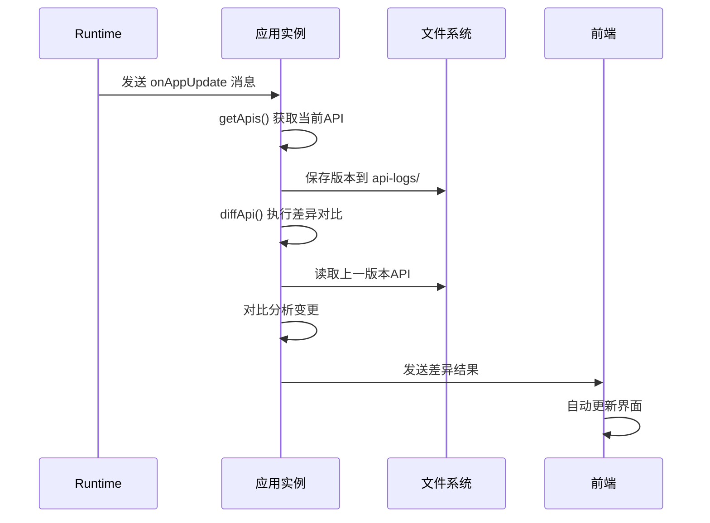

# API Diff 功能使用指南

## 🎯 功能概述

API Diff 功能实现了应用版本间的API变更检测，支持自动识别新增、修改、删除的API，并将变更信息推送给前端，实现界面的自动更新。

## 🔄 工作流程



## 📁 文件结构

```
/app/workplace/api-logs/
├── v1.json          # 版本1的API定义
├── v2.json          # 版本2的API定义
├── v3.json          # 版本3的API定义
└── ...
```

*注：不再需要额外的版本目录层级，所有版本文件直接存储在api-logs目录下*

## 🎛️ 核心数据结构

### ApiVersion - 版本信息
```go
type ApiVersion struct {
    Version   string    `json:"version"`   // 版本号
    Timestamp time.Time `json:"timestamp"` // 创建时间
    Apis      []*ApiInfo `json:"apis"`     // API列表
}
```

### ApiInfo - API信息
```go
type ApiInfo struct {
    Code           string          `json:"code"`             // API唯一标识
    Name           string          `json:"name"`             // API名称
    Desc           string          `json:"desc"`             // API描述
    Tags           []string        `json:"tags"`             // 标签
    Router         string          `json:"router"`           // 路由路径
    Method         string          `json:"method"`           // HTTP方法
    CreateTables   []string        `json:"create_tables"`    // 创建的表
    Request        []*widget.Field `json:"request"`          // 请求字段
    Response       []*widget.Field `json:"response"`         // 响应字段
    AddedVersion   string          `json:"added_version"`     // API首次添加的版本
    UpdateVersions []string        `json:"update_versions"`   // API更新过的版本列表
}
```

### ApiDiffResult - 差异结果
```go
type ApiDiffResult struct {
    Add    []*ApiInfo `json:"add"`    // 新增的API
    Update []*ApiInfo `json:"update"` // 修改的API
    Delete []*ApiInfo `json:"delete"` // 删除的API
}
```

## 🔧 使用方式

### 1. 触发API更新检测

Runtime发送消息到主题：
```
app.update.{user}.{app}.{version}
```

### 2. 应用自动处理

应用收到消息后自动执行：
1. 提取当前所有API信息
2. 保存当前版本到文件系统
3. 加载上一版本进行对比
4. 生成差异结果
5. 发送响应到runtime

### 3. 接收差异结果

前端监听响应主题：
```
app.update.response.{user}.{app}.{version}
```

## 📊 响应格式

```json
{
  "status": "success",
  "message": "API diff completed successfully",
  "data": {
    "add": [
      {
        "code": "crm_ticket",
        "name": "工单管理",
        "router": "/crm/crm_ticket",
        "method": "GET",
        "request": [...],
        "response": [...],
        "added_version": "v3",
        "update_versions": []
      }
    ],
    "update": [
      {
        "code": "user_management",
        "name": "用户管理",
        "router": "/user/user_management",
        "method": "GET",
        "request": [...],
        "response": [...],
        "added_version": "v1",
        "update_versions": ["v2", "v3", "v5"]
      }
    ],
    "delete": [...]
  },
  "version": "v5",
  "timestamp": "2024-01-15T10:30:00Z"
}
```

## 🎯 差异检测规则

### 新增API (Add)
- 当前版本存在，上一版本不存在的API
- 通常是新创建的功能模块

### 修改API (Update)
- 两个版本都存在，但内容有差异
- 检测以下变更：
  - API名称、描述、标签
  - 请求参数结构
  - 响应数据结构
  - 创建表定义

### 删除API (Delete)
- 上一版本存在，当前版本不存在的API
- 通常是移除的功能模块

## 🔍 字段级差异检测

系统支持精确的字段级差异检测：

### 字段属性对比
- **Code**: 字段标识符
- **Name**: 显示名称
- **Desc**: 字段描述
- **Widget.Type**: 组件类型
- **Widget.Config**: 组件配置
- **Validation**: 验证规则

### 检测示例
```go
// 修改前
oldField := &widget.Field{
    Code: "priority",
    Name: "优先级",
    Widget: struct{Type string; Config interface{}}{
        Type: "select",
        Config: map[string]interface{}{"options": "低,中,高"},
    },
}

// 修改后
newField := &widget.Field{
    Code: "priority",
    Name: "优先级",
    Widget: struct{Type string; Config interface{}}{
        Type: "select",
        Config: map[string]interface{}{"options": "低,中,高,紧急"},
    },
}

// 系统会检测到配置变更，标记为update
```

## 🚀 实际应用场景

### 场景1：新增功能
```
用户需求："我需要给工单系统增加一个附件上传功能"
LLM生成：包含upload_file.go的新API
系统检测：识别到新的API，前端自动添加上传界面
```

### 场景2：字段修改
```
用户需求："工单优先级需要增加'紧急'选项"
LLM修改：更新CrmTicket结构体的Priority字段
系统检测：识别到字段配置变更，前端下拉框自动添加新选项
```

### 场景3：功能移除
```
用户需求："不需要备注功能了"
LLM删除：移除Remark字段和相关处理
系统检测：识别到字段删除，前端自动移除相关组件
```

## 📝 注意事项

1. **版本管理**: 系统自动管理版本文件，无需手动干预
2. **文件存储**: API信息存储在容器的持久化目录中
3. **性能考虑**: 差异检测在内存中进行，性能优异
4. **错误处理**: 所有步骤都有完善的错误处理和日志记录
5. **向后兼容**: 新版本总是兼容旧版本的API结构

## 🔗 相关组件

- **Runtime**: 负责触发更新检测
- **Widget系统**: 提供字段解析和渲染支持
- **NATS**: 提供消息通信能力
- **文件系统**: 持久化存储版本信息

这个功能是实现"热更新"和"界面自动适配"的核心技术支撑！