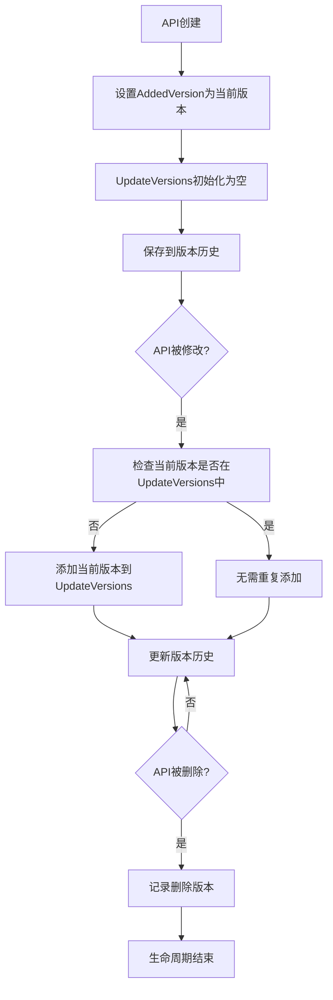

# API更新版本追踪功能

## 🎯 功能概述

在`ApiInfo`结构体中新增了`UpdateVersions`字段，用于记录API在哪些版本中被修改过。这个功能与`AddedVersion`字段配合，可以完整追踪API的完整生命周期。

## 🔧 实现细节

### 1. 数据结构更新

```go
type ApiInfo struct {
    // ... 其他字段
    AddedVersion   string   `json:"added_version"`    // API首次添加的版本
    UpdateVersions []string `json:"update_versions"`  // API更新过的版本列表
}
```

### 2. 版本管理逻辑

#### 新增API
```go
// 新API的UpdateVersions初始化为空数组
api := &ApiInfo{
    AddedVersion:   env.Version,
    UpdateVersions: []string{},   // 初始为空，还未更新过
}
```

#### 修改API
```go
// 修改API时添加当前版本到UpdateVersions列表
modifiedApi.UpdateVersions = make([]string, len(previousApi.UpdateVersions))
copy(modifiedApi.UpdateVersions, previousApi.UpdateVersions)

// 避免重复添加同一版本
if !a.containsVersion(modifiedApi.UpdateVersions, env.Version) {
    modifiedApi.UpdateVersions = append(modifiedApi.UpdateVersions, env.Version)
}
```

## 📊 版本追踪场景

### 场景1：API首次创建
```
版本v1: 新增 "用户管理" API
结果:
{
  "added_version": "v1",
  "update_versions": []
}
```

### 场景2：API多次修改
```
版本v1: 新增 "用户管理" API → added_version: "v1", update_versions: []
版本v2: 修改 "用户管理" API → added_version: "v1", update_versions: ["v2"]
版本v3: 修改 "用户管理" API → added_version: "v1", update_versions: ["v2", "v3"]
版本v5: 再次修改 → added_version: "v1", update_versions: ["v2", "v3", "v5"]
```

### 场景3：API完整生命周期
```json
{
  "code": "user_management",
  "name": "用户管理",
  "added_version": "v1",
  "update_versions": ["v2", "v3", "v5", "v7"],
  "current_version": "v8",
  "total_changes": 4,
  "last_updated": "v7",
  "age": "7个版本"
}
```

## 🎯 实际应用价值

### 1. API活跃度分析
```go
// 分析API的更新频率
func analyzeAPIActivity(api *ApiInfo) ActivityLevel {
    updateCount := len(api.UpdateVersions)

    switch {
    case updateCount == 0:
        return Inactive     // 从未更新过
    case updateCount <= 2:
        return Stable       // 很少更新
    case updateCount <= 5:
        return Active       // 正常更新
    default:
        return HighlyActive // 频繁更新，可能存在问题
    }
}
```

### 2. 前端版本提示
```javascript
// 根据API的更新历史显示不同的提示
function renderAPIStatus(api) {
    const updateCount = api.update_versions.length;
    const lastUpdate = api.update_versions[updateCount - 1];

    if (updateCount === 0) {
        return '<span class="badge stable">稳定版本</span>';
    } else if (updateCount > 5) {
        return `<span class="badge warning">频繁更新 (${updateCount}次)</span>`;
    } else {
        return `<span class="badge normal">最近更新: v${lastUpdate}</span>`;
    }
}
```

### 3. 技术债务识别
```go
// 识别可能存在技术债务的API
func identifyTechnicalDebt(apis []*ApiInfo) []*ApiInfo {
    var debt []*ApiInfo

    for _, api := range apis {
        // 从未更新过但版本很老的API
        if len(api.UpdateVersions) == 0 && isOldAPI(api) {
            debt = append(debt, api)
        }

        // 频繁更新的API可能设计不稳定
        if len(api.UpdateVersions) > 5 {
            debt = append(debt, api)
        }
    }

    return debt
}
```

### 4. 版本发布影响分析
```go
// 分析某个版本发布的API变更影响
func analyzeVersionImpact(version string, apis []*ApiInfo) VersionImpact {
    var newAPIs, modifiedAPIs []*ApiInfo

    for _, api := range apis {
        if api.AddedVersion == version {
            newAPIs = append(newAPIs, api)
        } else if containsVersion(api.UpdateVersions, version) {
            modifiedAPIs = append(modifiedAPIs, api)
        }
    }

    return VersionImpact{
        Version:        version,
        NewAPIs:       newAPIs,
        ModifiedAPIs:   modifiedAPIs,
        TotalChanges:   len(newAPIs) + len(modifiedAPIs),
    }
}
```

## 🔄 API更新追踪流程



## 📈 数据分析和可视化

### 1. API变更统计
```sql
-- 查询每个版本的API变更数量
SELECT
    v1.version as release_version,
    COUNT(CASE WHEN a.added_version = v1.version THEN 1 END) as new_apis,
    COUNT(CASE WHEN JSON_CONTAINS(a.update_versions, v1.version) THEN 1 END) as modified_apis
FROM api_versions a, version_info v1
GROUP BY v1.version
ORDER BY v1.version;
```

### 2. API热力图
```go
type APIHeatmap struct {
    APICode       string    `json:"api_code"`
    APIName       string    `json:"api_name"`
    ChangesCount  int       `json:"changes_count"`
    LastChanged   string    `json:"last_changed"`
    Stability     float64   `json:"stability"`
    RiskLevel     string    `json:"risk_level"`
}

func generateHeatmap(apis []*ApiInfo) []APIHeatmap {
    var heatmap []APIHeatmap

    for _, api := range apis {
        changes := len(api.UpdateVersions)
        lastChanged := ""
        if changes > 0 {
            lastChanged = api.UpdateVersions[changes-1]
        }

        heatmap = append(heatmap, APIHeatmap{
            APICode:      api.Code,
            APIName:      api.Name,
            ChangesCount: changes,
            LastChanged:  lastChanged,
            Stability:    calculateStability(api),
            RiskLevel:    assessRiskLevel(api),
        })
    }

    return heatmap
}
```

### 3. 版本时间线
```json
{
  "api_timeline": {
    "user_management": {
      "v1": {"action": "add", "description": "新增用户管理API"},
      "v2": {"action": "update", "description": "增加邮箱字段"},
      "v3": {"action": "update", "description": "修改权限验证"},
      "v5": {"action": "update", "description": "优化查询性能"},
      "v7": {"action": "update", "description": "添加用户分组功能"}
    }
  }
}
```

## 🔮 高级功能扩展

### 1. API变更预测
```go
// 基于历史数据预测API可能的变更
func predictAPIChanges(api *ApiInfo, nextVersion string) []ChangePrediction {
    var predictions []ChangePrediction

    updatePattern := analyzeUpdatePattern(api.UpdateVersions)

    // 如果有规律的更新模式
    if updatePattern.IsRegular {
        predictions = append(predictions, ChangePrediction{
            Type:        "regular_update",
            Probability: 0.8,
            Description: "根据历史模式，此版本可能需要更新",
        })
    }

    return predictions
}
```

### 2. API健康评分
```go
// 为API计算健康评分 (0-100)
func calculateAPIHealthScore(api *ApiInfo) HealthScore {
    score := 100.0

    // 频繁更新扣分
    updateCount := len(api.UpdateVersions)
    if updateCount > 10 {
        score -= 20
    } else if updateCount > 5 {
        score -= 10
    }

    // 长期未更新扣分
    if updateCount == 0 && isOldAPI(api) {
        score -= 15
    }

    // 根据添加版本计算稳定性加成
    if isMatureAPI(api) {
        score += 10
    }

    return HealthScore{
        Score:    score,
        Grade:    getGrade(score),
        Factors:  getScoreFactors(api),
    }
}
```

### 3. 变更影响分析
```go
// 分析API变更对系统的影响
func analyzeChangeImpact(oldApi, newApi *ApiInfo) ChangeImpact {
    impact := ChangeImpact{
        Severity: "low",
        Areas:    []string{},
    }

    // 检查字段变更
    if len(newApi.Request) != len(oldApi.Request) {
        impact.Severity = "medium"
        impact.Areas = append(impact.Areas, "request_schema")
    }

    // 检查表结构变更
    if !a.deepEqualStrings(oldApi.CreateTables, newApi.CreateTables) {
        impact.Severity = "high"
        impact.Areas = append(impact.Areas, "database_schema")
    }

    return impact
}
```

## ✅ 总结

UpdateVersions功能为AI Agent OS提供了完整的API变更历史追踪能力：

1. **完整历史**: 记录API从创建到每次修改的完整版本历史
2. **活跃度分析**: 通过更新频率识别API的活跃程度
3. **风险评估**: 识别需要关注的技术债务和不稳定API
4. **智能提示**: 前端可以根据历史数据提供更好的用户体验
5. **数据驱动**: 为API优化和重构提供数据支持

这个功能让你的AI Agent OS不仅是代码生成工具，更是一个**智能的API生命周期管理平台**！🚀